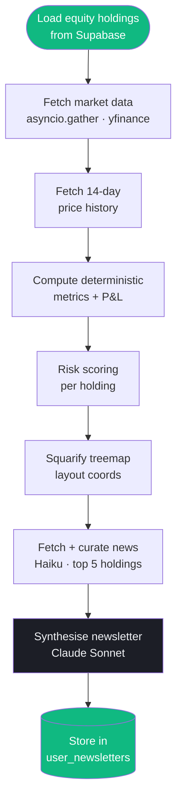

Vantage uses a custom two-tier orchestration layer built on top of the Anthropic API directly (not LangChain, not LlamaIndex). Every agent is a Python async function that calls Claude with registered tools and processes the response loop.

---

## Orchestrator

The orchestrator sits between every `/ai/stream` request and the specialist agents. It does two things: **classify intent** and **dispatch to the right specialist**.

### Intent classification

```python
async def classify_intent(query: str) -> str
```

**Step 1 — Regex classifier (~70% of queries)**

Five compiled pattern sets, each with 3–5 regexes covering common phrasings:

```python
CASHFLOW_PATTERNS = [
    r'\b(spend|spent|spending|expense|expenses|budget|transaction)\b',
    r'\b(category|categories|merchant|food|transport|groceries)\b',
    r'\b(income|salary|monthly|weekly|this month|last month)\b',
]
INVESTMENT_PATTERNS = [
    r'\b(stock|portfolio|holding|crypto|bitcoin|etf|market)\b',
    r'\b(gain|loss|return|p&l|price|allocation|dividend)\b',
]
DEBT_PATTERNS = [
    r'\b(loan|debt|owe|credit card|utilization|payoff|balance)\b',
    r'\b(interest|apr|installment|repay|minimum payment)\b',
]
WEALTH_PATTERNS = [
    r'\b(net worth|savings rate|assets|liabilities|wealth|transfer)\b',
    r'\b(financial health|balance sheet|cashflow|emergency fund)\b',
]
MARKET_PATTERNS = [
    r'\b(price|quote|ticker|aapl|btc|eth|market cap|52-week)\b',
    r'\b(compare|vs|versus|performance|return)\b',
]
```

If exactly one domain matches → return immediately, no LLM call.

**Step 2 — Claude Haiku fallback (ambiguous queries)**

When multiple domains match, or none match, a one-shot Haiku call resolves it:

```python
prompt = f"""Classify this financial question into exactly one domain.
Domains: cashflow | investment | debt | wealth | market

Question: {query}

Respond with JSON only: {{"domain": "<label>"}}"""
```

Cost per call: ~$0.0003. Latency: ~200ms.

### Specialist dispatch

```python
async def run_specialist_full_stream(domain, messages, user_id):
    domain_tools = TOOL_REGISTRY[domain]
    conversation = build_conversation(messages, user_id)

    while True:
        response = await claude_sonnet.messages.stream(
            model="claude-sonnet-4-5",
            tools=domain_tools,
            messages=conversation,
        )
        # stream phase/token events to Flutter as they arrive
        async for chunk in response:
            yield chunk

        if response.stop_reason == "end_turn":
            break

        # execute tool calls (parallel where independent)
        tool_results = await asyncio.gather(*[
            execute_tool(tc) for tc in response.tool_use_blocks
        ])
        conversation.extend(tool_results)
```

Tool calls within a single loop iteration that fetch independent data (e.g. `query_transactions` + `get_budgets`) run concurrently via `asyncio.gather`. The loop continues until Claude returns `stop_reason: "end_turn"` — typically 1–3 iterations.

---

## Specialist agents

Five specialists, each backed by Claude Sonnet with its own tool registry:

| Specialist | Domain | Tools available |
|------------|--------|----------------|
| Cash Flow | Spending, budgets, income, subscriptions | `query_transactions`, `get_budgets`, `scan_subscriptions`, `project_budget` |
| Investment | Holdings, prices, history, allocation | `get_portfolio`, `fetch_stock_price`, `fetch_crypto_price`, `fetch_price_history` |
| Debt | Credit cards, loans, social debts | `get_debts`, loan calc utilities |
| Wealth | Net worth, accounts, financial health | `get_portfolio`, `query_transactions`, `get_debts`, `get_budgets`, `run_anomaly_detection` |
| Market | Live prices, forex, asset comparison | `fetch_stock_price`, `fetch_crypto_price`, forex tools |

All specialists share the same Claude Sonnet version and tool-use loop. The only difference is which tools are registered.

---

## AnomalyAlerts agent

Runs on a schedule (daily 2AM) and on every `/ai/daily-insights` call. Three detection methods run in sequence:

### Z-score category anomaly

```python
def _detect_category_anomalies(transactions: list[dict]) -> list[dict]:
    # Group by category → by week
    # For each category: compute mean and std of weekly spend
    # Flag any week where spend > mean + 2 * std
```

Detection threshold: **2σ above the category's historical weekly mean**. Requires at least 4 weeks of history to fire (avoids false positives in new accounts).

Alert format:
```json
{
  "type": "high_spend",
  "severity": "warning",
  "title": "Unusually high food spending this week",
  "description": "Food spending this week ($312) is 3.2× your weekly average ($97).",
  "metadata": { "category": "Food & Dining", "amount": 312, "z_score": 3.2 }
}
```

### Duplicate charge detection

```python
def _detect_duplicates(transactions: list[dict]) -> list[dict]:
    # Group by (merchant, amount)
    # Within each group: flag pairs where timestamps are within 24 hours
    # Max 3 alerts returned
```

A "duplicate" is defined as: same merchant name (case-insensitive) + same amount, within a 24-hour window. This catches double-charges from payment retries without flagging legitimate weekly subscriptions.

### Budget threshold checks

```python
def _check_budgets(user_id: str) -> list[dict]:
    # Fetch active budgets from Supabase
    # For each budget category: sum MTD transactions
    # EXCEEDED: spend > budget_limit → severity "critical"
    # WARNING: spend > 0.80 * budget_limit → severity "warning"
```

MTD = month-to-date from 1st of current month. Budget limits are per-category.

---

## NewsletterGenerator agent

Runs weekly (Sunday 3AM) via APScheduler. A 8-stage pipeline that produces a structured JSON newsletter stored in `user_newsletters`.



### Market detection

Each ticker is assigned a market via suffix:

```python
def _detect_market(ticker: str) -> str:
    if ticker.endswith((".NS", ".BO")):
        return "India"      # NSE / BSE
    if ticker.endswith(".SI"):
        return "Singapore"  # SGX
    return "US"             # Default NYSE/NASDAQ
```

Currency mapping: India → INR, Singapore → SGD, US → USD.

### Risk scoring

Every holding gets a composite risk score from 1 (lowest) to 10 (highest):

```
risk = liquidity × 0.20 + concentration × 0.30 + volatility × 0.30 + correlation × 0.20
```

| Component | Weight | How calculated |
|-----------|--------|---------------|
| **Liquidity** | 20% | Based on market cap in billions: >200B→1, >50B→2, >10B→3, >2B→4, >0.5B→6, >0.1B→8, else→10 |
| **Concentration** | 30% | Portfolio weight %: <2%→1, <4%→2, <6%→3 ... <30%→9, ≥30%→10 |
| **Volatility** | 30% | Annualised σ from 14-day log returns: `np.std(log_returns, ddof=1) × √252`. <10%→1 ... ≥80%→10 |
| **Correlation** | 20% | Mean absolute correlation with all other holdings over 14 days. <10%→1 ... ≥90%→10 |

### Portfolio normalisation

All market values converted to USD for cross-currency weighting:

```python
_APPROX_USD_RATES = {"INR": 0.012, "USD": 1.0, "SGD": 0.74}

total_usd = sum(
    qty * price * _APPROX_USD_RATES.get(currency, 1.0)
    for holding in holdings
)
weight_pct = (holding_usd / total_usd) * 100
```

These are approximate rates for relative weight calculations only — not used for user-facing financial figures.

### Claude usage split

| Stage | Model | Why |
|-------|-------|-----|
| News curation | Haiku | Filters 20+ headlines to 8 most relevant — simple ranking task |
| Synthesis | Sonnet | Generates market commentary, stress scenarios, rebalancing actions — requires reasoning |

### Newsletter JSON schema

Sonnet outputs a structured JSON object stored verbatim:

```json
{
  "overall_summary": "2 sentences citing exact P&L numbers",
  "insights": [
    { "title": "5-8 word heading", "body": "3-4 sentences", "sentiment": "BULLISH|BEARISH|NEUTRAL" }
  ],
  "market_commentary": {
    "US": { "headline": "...", "body": ["paragraph"], "key_signals": ["..."] }
  },
  "macro_health": {
    "overall_score": 72,
    "label": "Healthy",
    "subscores": { "growth": 80, "inflation": 65, "rates": 70, "external": 75, "fiscal": 68, "credit": 72 }
  },
  "stress_scenarios": [
    { "scenario": "Rate spike", "probability": "15%", "estimated_drawdown_pct": -18, "most_affected": ["MSFT"] }
  ],
  "rebalance_actions": [
    { "ticker": "AAPL", "current_weight_pct": 32, "target_weight_pct": 20, "action": "TRIM", "rationale": "..." }
  ]
}
```

---

## Tool decorator

All tools for specialist agents use a `@tool` decorator that auto-generates the Claude API tool schema from the function signature and docstring:

```python
from tools.base import tool

@tool
async def query_transactions(
    user_id: str,
    days: int = 30,
    category: str = "",
    limit: int = 50,
) -> str:
    """
    Fetch and summarise a user's recent transactions.

    Args:
        user_id: The authenticated user's UUID.
        days: Number of days to look back (default 30).
        category: Optional category filter. Empty string returns all.
        limit: Max transactions to return (default 50).
    """
    ...
```

The `@tool` decorator reads the type annotations and docstring to produce:
```json
{
  "name": "query_transactions",
  "description": "Fetch and summarise a user's recent transactions.",
  "input_schema": {
    "type": "object",
    "properties": {
      "user_id": { "type": "string" },
      "days": { "type": "integer", "default": 30 },
      "category": { "type": "string", "default": "" },
      "limit": { "type": "integer", "default": 50 }
    },
    "required": ["user_id"]
  }
}
```

**Rules for writing tools:**
- Always scope to `user_id` — never return cross-user data
- Return `str` for context-fed tools (Claude reads them), `dict` for structured data
- No required parameters without defaults except `user_id`
- Keep names snake_case and globally unique across all tool files
- All Supabase queries must use the authenticated client (RLS enforced)

---

## Asyncio patterns

### In-flight deduplication (Dart, market data)

```dart
final _inflightStock = <String, Completer<Map<String, StockPriceData>>>{};

Future<Map<String, StockPriceData>> getStockPrices(List<String> symbols) async {
    final key = (symbols..sort()).join(',');
    if (_inflightStock.containsKey(key)) {
        return _inflightStock[key]!.future; // reuse in-flight request
    }
    final completer = Completer<Map<String, StockPriceData>>();
    _inflightStock[key] = completer;
    try {
        final result = await _fetchFromBackend(symbols);
        completer.complete(result);
        return result;
    } finally {
        _inflightStock.remove(key);
    }
}
```

This prevents duplicate HTTP requests when multiple Riverpod providers request the same symbols concurrently (e.g. portfolio heatmap + holdings list both firing on mount).

### asyncio.gather in Python tools

```python
# newsletter_generator.py — all ticker data fetched in parallel
ticker_data, history_data = await asyncio.gather(
    asyncio.gather(*[_fetch_ticker_data(t) for t in tickers]),
    asyncio.gather(*[_fetch_price_history_14d(t) for t in tickers]),
)
```

yfinance calls are CPU-bound. They run in a `ThreadPoolExecutor` via `asyncio.to_thread()` so they don't block the uvicorn event loop.

### AnomalyAlerts in sync context

`run_anomaly_detection` (the Agno `@tool` wrapper) may be called from inside a running uvicorn event loop. Standard `asyncio.run()` would raise `RuntimeError: cannot be called from a running event loop`. The workaround:

```python
try:
    loop = asyncio.get_running_loop()
    # We're inside uvicorn — run in a thread
    with ThreadPoolExecutor() as pool:
        future = pool.submit(asyncio.run, AnomalyAlerts(user_id).detect())
        return future.result()
except RuntimeError:
    # No running loop — safe to call directly
    return asyncio.run(AnomalyAlerts(user_id).detect())
```
