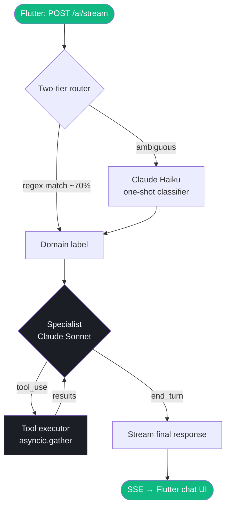

## Overview

Every question you ask goes through a two-stage pipeline: a **fast intent router** that classifies your question without burning tokens, followed by a **Claude Sonnet specialist** that runs a deterministic tool-use loop against your real data.



---

## Stage 1: Intent router

The router assigns one of five domain labels: `cashflow`, `investment`, `debt`, `wealth`, or `market`.

### Step 1 — Regex classifier (no LLM call)

About 70% of queries are classified instantly by matching domain-specific keyword patterns:

```python
CASHFLOW_PATTERNS = [
    r'\b(spend|spent|spending|expense|expenses|budget|transaction)\b',
    r'\b(category|categories|merchant|food|transport|groceries)\b',
    r'\b(income|salary|monthly|weekly|this month|last month)\b',
]

INVESTMENT_PATTERNS = [
    r'\b(stock|portfolio|holding|crypto|bitcoin|etf|market)\b',
    r'\b(gain|loss|return|p&l|price|allocation|dividend)\b',
]

DEBT_PATTERNS = [
    r'\b(loan|debt|owe|credit card|utilization|payoff|balance)\b',
    r'\b(interest|apr|installment|repay|minimum payment)\b',
]

WEALTH_PATTERNS = [
    r'\b(net worth|savings rate|assets|liabilities|wealth|transfer)\b',
    r'\b(financial health|balance sheet|cashflow|emergency fund)\b',
]

MARKET_PATTERNS = [
    r'\b(price|quote|ticker|aapl|btc|eth|market cap|52-week)\b',
    r'\b(compare|vs|versus|performance|return)\b',
]
```

### Step 2 — Haiku fallback

If a query matches multiple domains, or matches none, a one-shot Claude Haiku call resolves it:

```python
prompt = f"""Classify this financial question into exactly one domain.
Domains: cashflow | investment | debt | wealth | market

Question: {user_message}

Respond with JSON only: {{"domain": "<label>"}}"""
```

Haiku returns a domain label in ~200ms. The cost per call is negligible (< $0.001).

---

## Stage 2: Specialist tool-use loop

The specialist is Claude Sonnet with all tools for the matched domain pre-registered. Claude decides which tools to call, in what order, and when it has enough information to answer.

```python
async def run_specialist_full_stream(domain, messages, user_id):
    domain_tools = TOOL_REGISTRY[domain]
    conversation = build_conversation(messages, user_id)

    while True:
        response = await claude_sonnet.messages.create(
            model="claude-sonnet-4-5",
            tools=domain_tools,
            messages=conversation,
            stream=True,
        )

        # Stream phase/token events to Flutter as they arrive
        async for event in response:
            yield event

        if response.stop_reason == "end_turn":
            break

        # Execute tool calls (parallel where independent)
        tool_results = await asyncio.gather(*[
            execute_tool(tc) for tc in response.tool_use_blocks
        ])
        conversation.extend(tool_results)
```

Tools that fetch independent data (e.g. `query_transactions` + `get_budgets`) run concurrently via `asyncio.gather`. Tools with dependencies run sequentially within the same loop iteration.

---

## SSE event stream

The `/ai/stream` endpoint sends Server-Sent Events. The Flutter app reacts to each event in real time:

| Event type | Payload | Flutter UI effect |
|------------|---------|-------------------|
| `phase` | `"thinking"` | Animated dots — "Thinking..." |
| `phase` | `"generating"` | Animated dots — "Generating..." |
| `tool` | `{name, status: "calling"}` | Tool badge: "Analyzing transactions..." |
| `token` | `{text}` | Streamed text appended to chat bubble |
| `done` | `{text, widgets, suggestions, tools_used, agent_used}` | Finalize message, render widgets |
| `error` | `{message}` | Error bubble shown |

### Widget responses

When the answer is better expressed as a chart or card, Claude returns structured JSON in the `done` event `widgets` field, which Flutter's `widget_renderer.dart` renders natively:

```json
{
  "type": "chart",
  "chart_type": "bar",
  "title": "Spending by Category — March",
  "data": {
    "labels": ["Food", "Transport", "Shopping"],
    "values": [420, 180, 310]
  }
}
```

---

## Background pipelines

Two background jobs run outside the request cycle:

### Daily insights (APScheduler — 2 AM daily)

The `AnomalyAlerts` agent runs over the last 90 days of transactions and writes alerts to the `user_insights` Supabase table. The Dashboard reads from this table in real time.

Three detection methods run on every cycle:

| Method | Technique | Example alert |
|--------|-----------|---------------|
| Category spend anomaly | Z-score (threshold: 2σ) | "Food spend this week is 3.2× your weekly average" |
| Duplicate charges | Same merchant + amount within 24h | "Possible duplicate: $12.90 at Starbucks (×2 today)" |
| Budget threshold | MTD spend vs budget limit | "Shopping budget 87% used with 10 days left" |

### Weekly newsletter (APScheduler — Sunday 3 AM)

The `NewsletterGenerator` agent compiles a portfolio summary, top movers, and AI-curated market commentary. Delivered via push notification.

---

## Conversation memory

The Flutter app sends the last 10 messages (5 exchanges) as context with each `/stream` request. The backend converts Flutter's `{text, isUser}` format to Claude's `{role: "user"|"assistant", content}` format before passing to the specialist.

All conversations are persisted to Supabase (`ai_conversations` table) so context survives app restarts.

---

## Security

- Every request carries a Supabase JWT in `Authorization: Bearer <token>`
- The backend validates the JWT using Supabase's JWKS endpoint before any data access
- All Supabase queries use the authenticated service client with RLS enforced — a user can never query another user's data through the AI
- The raw notification text (not the full notification object) is all that reaches Claude for parsing
