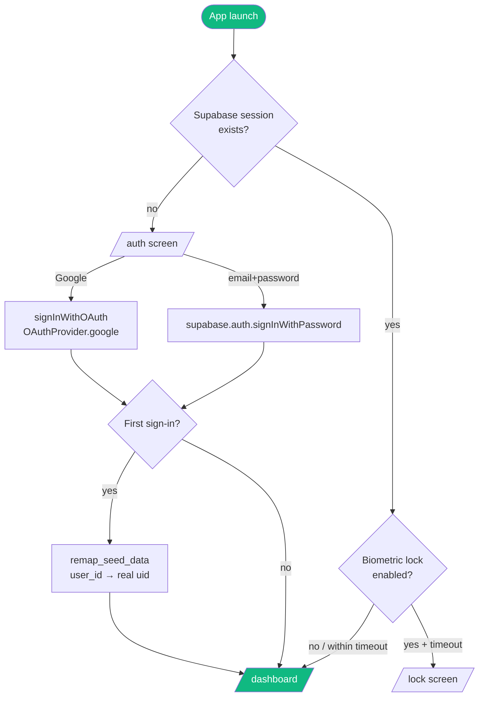

Vantage uses Supabase Auth with two sign-in methods: **email/password** and **Google OAuth via PKCE**. The backend validates every API request against Supabase's JWKS endpoint, with a 300-second token cache to reduce round-trips.

---

## Flutter auth flow



### Email/password

```dart
// Validation
if (email.isEmpty || !email.contains('@')) → show error
if (password.length < 6) → show error

// Sign up
await supabase.auth.signUp(email: email, password: password);

// Sign in
await supabase.auth.signInWithPassword(email: email, password: password);
```

### Google OAuth (PKCE)

```dart
await supabase.auth.signInWithOAuth(
    OAuthProvider.google,
    redirectTo: 'com.vantagewealth.app://callback',
);
```

The `redirectTo` URI is registered in `AndroidManifest.xml` as a deep link intent filter. Supabase handles the PKCE code exchange internally — no server-side callback route needed.

The redirect URI must be added to Supabase Auth → Providers → Google → Redirect URLs: `com.vantagewealth.app://callback`

---

## Seed data remap

New Supabase accounts are created with a trigger that auto-populates demo data linked to a placeholder UUID (`00000000-0000-0000-0000-000000000001`). On first sign-in, Vantage calls `remap_seed_data()` to re-link everything to the real user's UUID:

```dart
// Runs once — flag stored in SharedPreferences
final prefs = await SharedPreferences.getInstance();
final key = 'seed_remapped_${user.id}';
if (!prefs.getBool(key, false)) {
    await supabase.rpc('remap_seed_data', params: {
        'old_uid': '00000000-0000-0000-0000-000000000001',
        'new_uid': user.id,
    });
    prefs.setBool(key, true);
}
```

The `remap_seed_data` PostgreSQL function updates every foreign key and array member across all tables in a single transaction.

---

## Backend JWT validation

Every FastAPI endpoint that accesses user data uses the `get_current_user` dependency:

```python
async def get_current_user(
    credentials: HTTPAuthorizationCredentials = Depends(security),
    supabase: Client = Depends(get_supabase),
) -> str:
    token = credentials.credentials

    # Check in-memory cache (300s TTL) — avoids a Supabase round-trip
    cached_uid = auth_cache.get(f"jwt:{token}")
    if cached_uid:
        return cached_uid

    # Validate against Supabase JWKS
    res = supabase.auth.get_user(token)
    if not res or not res.user:
        raise HTTPException(status_code=401, detail="Invalid credentials")

    uid = res.user.id
    auth_cache.set(f"jwt:{token}", uid, ttl_seconds=300)
    return uid
```

The JWT cache key is the full token string. TTL is 300 seconds — matching Supabase's JWT expiry behaviour. After expiry, the next request re-validates against Supabase.

**Security guarantee:** Because RLS is enforced on every Supabase query, even if a token were somehow spoofed, all queries would return empty results for any `user_id` that doesn't match `auth.uid()`.

---

## Biometric lock

```dart
// AppRouter redirect logic
if (biometricEnabled && !isUnlocked) {
    // Only lock if elapsed time > 30 seconds since last activity
    final elapsed = DateTime.now().difference(lastActiveTime).inSeconds;
    if (elapsed > 30) return '/lock';
}
```

The 30-second timeout prevents the lock screen from appearing when the user briefly switches apps. Lock state is stored in-memory only — it resets on cold start.

The `/lock` screen uses `local_auth` to prompt Face ID / fingerprint. On success it sets `isUnlocked = true` and pops back to the previous route.

---

## Debug mode

```dart
if (kDebugMode) {
    // "Skip for now" button visible in auth screen
    // Signs in with hardcoded demo credentials:
    await supabase.auth.signInWithPassword(
        email: 'demo@vantagewealth.app',
        password: 'demo123456',
    );
}
```

This is stripped from release builds by the Dart compiler (`kDebugMode = false` in release mode).

---

## Auth state management

The Supabase Flutter SDK persists the session in secure storage (`flutter_secure_storage`). On cold start, `supabase.auth.currentSession` is non-null if a valid session exists — no network call needed.

The go_router redirect fires on every navigation attempt:

```dart
redirect: (context, state) {
    final session = supabase.auth.currentSession;
    final isAuth = state.matchedLocation == '/auth';

    if (session == null && !isAuth) return '/auth';
    if (session != null && isAuth) return '/dashboard';
    return null; // no redirect
},
```

Session changes (sign-in, sign-out, token refresh) trigger a `notifyListeners()` on the `GoRouter`'s refresh listenable, which re-evaluates the redirect.
