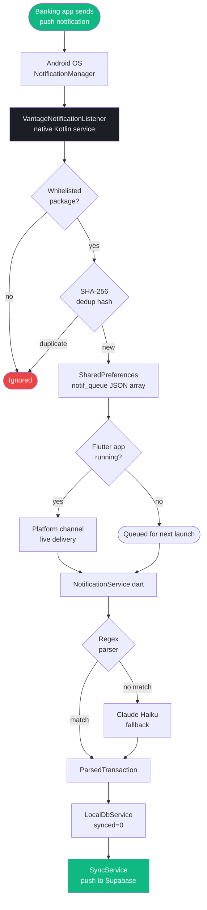

Transaction capture runs entirely on-device via a native Android service. No bank API. No screen scraping. The system intercepts the same push notifications your bank already sends you.

---

## System overview



---

## VantageNotificationListener (Kotlin)

**File:** `android/app/src/main/kotlin/.../VantageNotificationListener.kt`

The service extends Android's `NotificationListenerService`, which runs in the background even when the Flutter app is killed. It is registered in `AndroidManifest.xml` with `BIND_NOTIFICATION_LISTENER_SERVICE` permission — Android prompts the user to grant Notification Access in system settings.

### Banking app whitelist

Only notifications from these packages are processed:

```kotlin
val BANKING_PACKAGES = setOf(
    // Singapore
    "com.dbs.sg.dbsmbanking",
    "com.citibank.mobile.sg",
    "com.citibank.mobile.sgipb",
    "com.hsbc.hsbcsg",
    "sg.com.hsbc.hsbcsingapore",
    "com.uob.mighty",
    "com.uob.mighty.app",
    "com.google.android.apps.walletnfcrel",  // Google Wallet
    // India
    "com.citi.citimobile",
    "com.axis.mobile",
    "com.phonepe.app",
    // Brokerage
    "com.zerodha.kite",
    "com.futu.moomoo",
)
```

All other packages are silently ignored. This is the first filter — no battery or storage cost for irrelevant notifications.

### SHA-256 deduplication

Banking apps sometimes re-post or update notifications (e.g. when the balance refreshes). Without dedup, this would create duplicate transactions.

```kotlin
fun computeHash(packageName: String, text: String, timestamp: Long): String {
    // Round timestamp to nearest minute — prevents same notification
    // from appearing twice if the OS delivers it at slightly different times
    val minuteKey = (timestamp / 60_000) * 60_000
    val raw = "$packageName|$text|$minuteKey"
    return MessageDigest.getInstance("SHA-256")
        .digest(raw.toByteArray())
        .joinToString("") { "%02x".format(it) }
}
```

Hashes are stored in SharedPreferences with their timestamp. On each new notification:
1. Compute hash
2. Check SharedPreferences — if exists → drop
3. If new → store hash, process notification
4. Purge all hashes older than 5 days (runs inline on each insert)

```kotlin
const val HASH_TTL_MS = 5 * 24 * 60 * 60 * 1000L // 5 days
```

### Queue storage

Accepted notifications are appended to a JSON array in SharedPreferences under key `notif_queue`:

```kotlin
// Thread-safe — synchronized block
@Synchronized
fun enqueue(item: NotifQueueItem) {
    val prefs = context.getSharedPreferences("vantage_notif", Context.MODE_PRIVATE)
    val existing = JSONArray(prefs.getString("notif_queue", "[]"))
    existing.put(JSONObject().apply {
        put("packageName", item.packageName)
        put("title", item.title ?: "")
        put("text", item.text)
        put("timestamp", item.timestamp)
    })
    prefs.edit().putString("notif_queue", existing.toString()).apply()
}
```

### Live channel

If the Flutter app is in the foreground, the service also delivers to an `EventChannel`:

```kotlin
eventSink?.success(mapOf(
    "packageName" to packageName,
    "title"       to title,
    "text"        to text,
    "timestamp"   to timestamp,
))
```

Flutter's `NotificationService` listens to this stream and processes immediately — no need to drain the queue.

### Boot persistence

A `BroadcastReceiver` registered for `RECEIVE_BOOT_COMPLETED` restarts the listener after device reboot. Notifications received while the Flutter app hasn't launched yet accumulate in the SharedPreferences queue and are drained on first launch.

---

## NotificationService.dart

The Dart layer bridges the native queue to the parsing pipeline.

### Queue drain

Called on every app launch and resume:

```dart
Future<void> drainQueue() async {
    final rawQueue = await _channel.invokeMethod('drainQueue'); // clears queue atomically
    final items = (rawQueue as List).cast<Map<String, dynamic>>();

    for (final item in items) {
        await _processNotification(item);
    }
}
```

`drainQueue` on the Kotlin side reads and clears the SharedPreferences array in a single synchronized operation — no item is processed twice.

### Processing pipeline

```dart
Future<void> _processNotification(Map<String, dynamic> raw) async {
    final packageName = raw['packageName'] as String;
    final text        = raw['text'] as String;
    final title       = raw['title'] as String?;
    final timestamp   = DateTime.fromMillisecondsSinceEpoch(raw['timestamp']);

    // Step 1: try regex parser
    final parsed = NotificationParser.parse(
        packageName: packageName,
        text: text,
        title: title,
        timestamp: timestamp,
    );

    if (parsed != null) {
        await _saveTransaction(parsed);
        return;
    }

    // Step 2: Claude Haiku fallback (requires network)
    try {
        final aiParsed = await AiService.parseNotification(text);
        if (aiParsed != null) {
            await _saveTransaction(aiParsed.copyWith(source: packageName));
            return;
        }
    } catch (_) {
        // Network unavailable — fall through to pending queue
    }

    // Step 3: store for retry
    await LocalDbService.insertPendingNotification({
        'package_name': packageName,
        'title': title ?? '',
        'content': text,
        'received_at': timestamp.toIso8601String(),
    });
}
```

### Saving a parsed transaction

```dart
Future<void> _saveTransaction(ParsedTransaction parsed) async {
    final tx = Transaction(
        id: const Uuid().v4(),
        userId: SupabaseService.currentUserId,
        amount: parsed.amount,
        currency: parsed.currency,
        merchant: parsed.merchant,
        category: _categorise(parsed.merchant), // 500+ merchant mappings
        source: 'notification',
        rawNotificationText: parsed.rawText,
        parsedAt: DateTime.now(),
        createdAt: parsed.timestamp,
    );

    // Local first (synced=0)
    await LocalDbService.insertTransaction(tx.toMap());

    // Optimistic push to Supabase
    SyncService.pushTransactions().ignore();
}
```

---

## Android permissions required

```xml
<!-- AndroidManifest.xml -->
<uses-permission android:name="android.permission.RECEIVE_BOOT_COMPLETED" />

<service
    android:name=".VantageNotificationListener"
    android:label="Vantage Notification Listener"
    android:exported="true"
    android:permission="android.permission.BIND_NOTIFICATION_LISTENER_SERVICE">
    <intent-filter>
        <action android:name="android.service.notification.NotificationListenerService" />
    </intent-filter>
</service>
```

The user must grant Notification Access manually in Android Settings → Apps → Special App Access → Notification Access. The app's onboarding screen (`setup/android-setup`) guides the user through this step.
