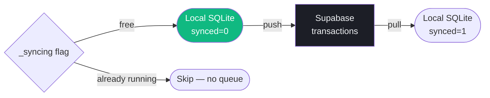

Vantage is offline-first. Every transaction is written to an encrypted local SQLite database before it ever touches the network. The app is fully usable without internet — data syncs automatically when connectivity returns.

---

## Local database

**Library:** `sqflite_sqlcipher` — SQLite with AES-256 encryption via SQLCipher.

**Encryption key:** Injected at build time via `--dart-define`:
```bash
flutter run --dart-define-from-file=.env.json
# .env.json includes: "DB_KEY": "your-32-char-key"
```

The key never appears in source code or any tracked file.

### Schema

```sql
CREATE TABLE transactions (
  id                   TEXT PRIMARY KEY,
  user_id              TEXT NOT NULL,
  account_id           TEXT,
  amount               REAL,
  currency             TEXT,
  merchant             TEXT,
  category             TEXT,
  source               TEXT DEFAULT 'manual',
  status               TEXT DEFAULT 'pending',
  raw_notification_text TEXT,
  parsed_at            TEXT,
  created_at           TEXT,
  synced               INTEGER DEFAULT 0   -- 0 = local only, 1 = pushed to Supabase
);

CREATE TABLE holdings (
  id            TEXT PRIMARY KEY,
  user_id       TEXT NOT NULL,
  symbol        TEXT NOT NULL,
  asset_type    TEXT,
  quantity      REAL,
  avg_price     REAL,
  purchase_date TEXT,
  currency      TEXT,
  exchange      TEXT,
  notes         TEXT,
  synced        INTEGER DEFAULT 0
);

CREATE TABLE pending_notifications (
  id           INTEGER PRIMARY KEY AUTOINCREMENT,
  package_name TEXT,
  title        TEXT,
  content      TEXT,
  received_at  TEXT,
  processed    INTEGER DEFAULT 0
);
```

**Indexes:**
```sql
CREATE INDEX idx_txn_created_at ON transactions(created_at DESC);
CREATE INDEX idx_txn_synced     ON transactions(synced);
CREATE INDEX idx_txn_user       ON transactions(user_id);
CREATE INDEX idx_pending_notif_processed ON pending_notifications(processed);
```

### Singleton and recovery

`LocalDbService` uses a `Completer`-based singleton — the database is opened once and reused:

```dart
static final Completer<Database> _completer = Completer();

Future<Database> get db async => _completer.future;
```

**Auto-recovery:** If the database fails to open (wrong encryption key, legacy unencrypted file, corruption), the service deletes the file and recreates it. Data is re-synced from Supabase on the next pull.

---

## Bidirectional sync

`SyncService` pushes local changes to Supabase and pulls remote changes to SQLite. Both directions are wrapped in database transactions for atomicity.



### Push — local → Supabase

```dart
Future<int> pushTransactions() async {
    if (_syncing) return 0;
    _syncing = true;
    try {
        final unsynced = await localDb.getUnsyncedTransactions();
        if (unsynced.isEmpty) return 0;

        // Strip the 'synced' field — Supabase doesn't have it
        final rows = unsynced.map((r) => {...r}..remove('synced')).toList();

        await supabase.from('transactions').upsert(rows);

        // Batch mark as synced in a single SQLite transaction
        await localDb.batchMarkSynced(unsynced.map((r) => r['id']).toList());
        return unsynced.length;
    } finally {
        _syncing = false;
    }
}
```

### Pull — Supabase → local

```dart
Future<void> pullTransactions() async {
    final rows = await supabase
        .from('transactions')
        .select()
        .eq('user_id', userId)
        .order('created_at', ascending: false)
        .limit(100);

    // All pulled rows are pre-marked synced=1
    final mapped = rows.map((r) => {
        ...r,
        'source': r['source'] ?? 'manual',
        'status': r['status'] ?? 'pending',
        'synced': 1,
    }).toList();

    // ConflictAlgorithm.replace → upsert behaviour
    await localDb.batchInsert('transactions', mapped);
}
```

### Conflict resolution

Last-write-wins. Server data takes precedence on pull — `ConflictAlgorithm.replace` overwrites local rows with the same `id`. There is no merge or three-way diff. This is intentional: Supabase is the source of truth; local is a cache + write buffer.

---

## Pending notifications queue

When a banking notification arrives but **both regex parsing and Haiku AI parsing fail** (e.g. no network for the AI call), the raw notification is stored in `pending_notifications` for retry:

```dart
await localDb.insertPendingNotification({
    'package_name': notification.packageName,
    'title': notification.title,
    'content': notification.text,
    'received_at': DateTime.now().toIso8601String(),
    'processed': 0,
});
```

On the next app launch, the notification service drains this queue and retries parsing against the now-available AI endpoint. Successfully parsed entries are marked `processed=1`.

---

## App lifecycle sync triggers

`VantageApp` prefetches all major providers on init **and** on every app resume:

```dart
void didChangeAppLifecycleState(AppLifecycleState state) {
    if (state == AppLifecycleState.resumed) {
        // Re-fetch all stale data
        ref.invalidate(dashboardSummaryProvider);
        ref.invalidate(transactionsProvider);
        ref.invalidate(holdingsWithPricesProvider);
        // ... + 6 more providers

        // Drain any queued notifications
        NotificationService.drainQueue();

        // Sync local → Supabase
        SyncService.syncAll();

        // Reconcile CC balances
        AccountsService.reconcileAllCards();

        // Update home screen widgets
        WidgetService.updateAll();
    }
}
```

---

## Credit card balance reconciliation

On every resume, Vantage recalculates all credit card balances from the transaction ledger:

```
balance = Σ(charges in current billing cycle) - Σ(payments in current billing cycle)
```

The current billing cycle starts the day after the `statement_day` on the account. This corrects any drift between the stored `balance` field and what the transactions actually show — no manual reconciliation needed.
