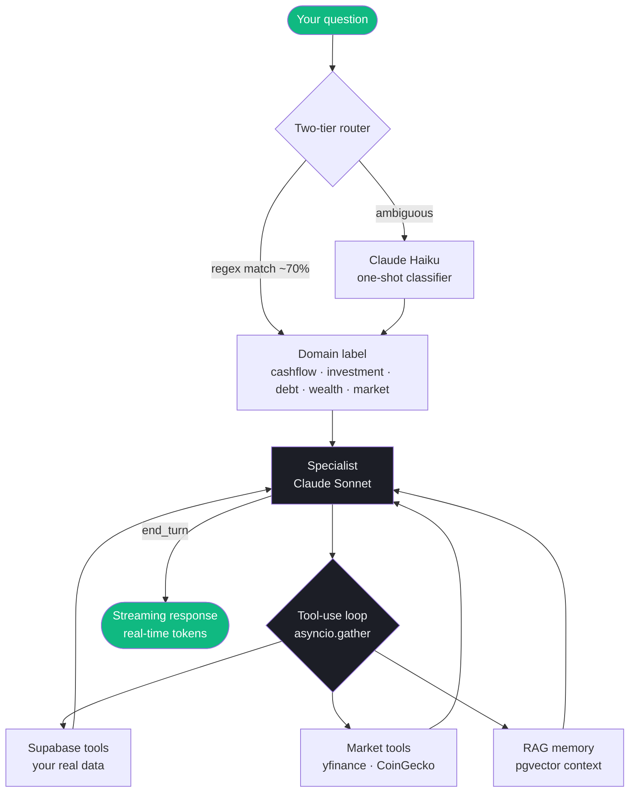

## What you can ask

The AI advisor connects to your real financial data. Everything it tells you is grounded in actual numbers from your accounts, transactions, and portfolio.

### Spending & budgets
- "How much did I spend on food last month?"
- "Compare my spending this month vs last month"
- "Which merchant do I spend the most at?"
- "Am I on track with my entertainment budget?"
- "Show me all transactions at Grab in March"
- "What are my recurring subscriptions?"

### Portfolio & investments
- "What's my portfolio worth right now?"
- "How is AAPL performing vs my cost basis?"
- "What's my allocation across stocks vs crypto?"
- "Which holdings have the best return?"
- "Am I too concentrated in tech?"

### Debt & credit cards
- "What's outstanding on my HSBC card?"
- "When is my UOB card due?"
- "If I pay $500 extra per month, when will I clear my loan?"
- "What's my total credit utilisation?"

### Net worth & wealth
- "What's my net worth today?"
- "What's my savings rate this month?"
- "Break down my assets vs liabilities"
- "Score my financial health"

### Market prices
- "What's the current price of AAPL?"
- "How has Bitcoin performed over the last month?"
- "What's the SGD to INR exchange rate?"
- "Compare MSFT vs GOOGL performance this year"

---

## How it works

The loading indicator in the app shows exactly what's happening: "Analyzing spending by category", "Fetching live price", "Computing net worth".

---

## Specialist domains

| Domain | Handles |
|--------|---------|
| **Cash Flow** | Transactions, budgets, income, merchants, categories |
| **Investment** | Holdings, market prices, historical charts, P&L, allocation |
| **Debt** | Credit cards, loans, payoff simulation, social debts |
| **Wealth** | Net worth, savings rate, financial health score, account balances |
| **Market** | Live prices, forex, asset comparison |

---

## AI memory (RAG)

The advisor remembers your financial patterns through an embedding-based memory system. Daily summaries of your spending, weekly patterns, and conversation history are embedded and stored in pgvector. When you ask a question, relevant context is retrieved and included in the prompt.

This means the AI can answer questions like "Is my food spending going up or down?" by referencing patterns across multiple months, not just the raw transaction list.

See [RAG Pipeline](/ai/rag-pipeline) for technical details.
