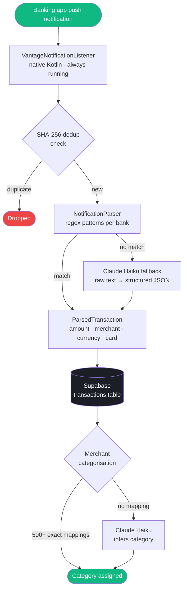

## How it works

When your bank sends a push notification — "SGD 45.50 spent at Grab" — Vantage reads it in the background, extracts the amount, merchant, and card details, categorises it, and logs it to your database. All automatically, within seconds of the transaction.



---

## The notification listener

Vantage uses a **native Kotlin `NotificationListenerService`** that runs independently of the Flutter app. Even if the app is killed, the listener keeps running and queues notifications in SharedPreferences for the next app launch.

Key properties:
- **Always-on**: survives app kills, device restarts (registered for `RECEIVE_BOOT_COMPLETED`)
- **Dedup**: SHA-256 hash of `packageName + text + timestamp_minute` — prevents duplicate entries from notification updates
- **5-day window**: hashes are stored for 5 days, then cleaned up
- **Queue**: if Flutter is not running, notifications are queued and drained on next launch

---

## Regex parsing

Each supported banking app has a set of `RegExp` patterns that match its specific notification format. The parser tries each pattern in order and returns the first successful match.

```dart
// Example: DBS Bank
RegExp(
  r'SGD\s*(?<amount>[\d,]+\.?\d*)\s*(?:spent|charged|debited)\s*'
  r'(?:on|at)\s*(?<merchant>.+?)'
  r'(?:\s*at\s*\d|\.|\s*Card)',
  caseSensitive: false,
),
```

Named capture groups extract:
- `amount` — the transaction amount
- `merchant` — merchant name (cleaned of trailing punctuation)
- `card` — last 4 digits of card (when available)
- `cur` — explicit currency code (e.g. `SGD` in "for SGD 45.50")

If no regex pattern matches, the raw notification text is sent to Claude Haiku for extraction.

---

## Merchant categorisation

After parsing, Vantage maps the merchant name to a spend category:

1. **Exact match** against 500+ merchant mappings (`lib/core/constants/merchants.dart`)
2. **Substring match** — case-insensitive contains check
3. **AI fallback** — Claude Haiku infers category from merchant name
4. **Uncategorised** — if all fail, user can manually correct

Corrections are saved per-user and take precedence in future transactions from the same merchant.

---

## Transaction types

| Type | Description |
|------|-------------|
| `debit` | Card spend or bank debit |
| `credit` | Refund, payment received |
| `trade_buy` | Stock/crypto purchase (brokerage apps) |
| `trade_sell` | Stock/crypto sale (brokerage apps) |

---

## Adding a new bank

See [Contributing — Adding a New Banking App](https://github.com/rmurarishetti/vantage/blob/main/CONTRIBUTING.md#adding-a-new-banking-app) for the step-by-step guide.
