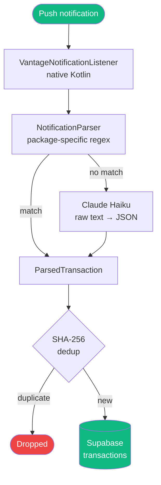

Vantage captures spending by listening to Android push notifications from your banking apps. No bank API, no screen scraping, no manual entry.

## How it works



The parser runs **locally on your device** — notification text never leaves your phone except when Haiku fallback is triggered, in which case only the raw text string is sent (never the full notification object or any metadata).

---

## Singapore

<AccordionGroup>
  <Accordion title="DBS Bank" icon="building-columns">
    **Package:** `com.dbs.sg.dbsmbanking`
    **Default currency:** SGD

    **Supported notification formats:**
    ```
    SGD 45.50 spent on Grab at 3:15 PM. Card ending 1234
    Card ending 1234: SGD 150.00 at FairPrice
    You spent SGD 32.00 at NTUC. DBS Visa ending 9012
    You have made a transaction of SGD 42.50 at GRAB FOOD with card ending 1234
    ```

    **Regex patterns (simplified):**
    ```dart
    // Pattern 1: "SGD <amount> spent on <merchant>"
    r'SGD\s*(?<amount>[\d,]+\.?\d*)\s+spent\s+(?:on\s+)?(?<merchant>.+?)(?:\s+at\s+[\d:]+|\.|\s+Card)'

    // Pattern 2: "Card ending <last4>: SGD <amount> at <merchant>"
    r'Card ending\s*(?<last4>\d{4}):\s*SGD\s*(?<amount>[\d,]+\.?\d*)\s+at\s+(?<merchant>.+?)(?:\.|$)'

    // Pattern 3: "You spent SGD <amount> at <merchant>"
    r'You\s+spent\s+SGD\s*(?<amount>[\d,]+\.?\d*)\s+at\s+(?<merchant>.+?)(?:\.|$)'

    // Pattern 4: "transaction of SGD <amount> at <merchant> with card ending <last4>"
    r'transaction\s+of\s+SGD\s*(?<amount>[\d,]+\.?\d*)\s+at\s+(?<merchant>.+?)\s+with\s+card\s+ending\s+(?<last4>\d{4})'
    ```
  </Accordion>

  <Accordion title="HSBC Singapore" icon="building-columns">
    **Packages:** `sg.com.hsbc.hsbcsingapore` / `com.hsbc.hsbcsg` (legacy)
    **Default currency:** SGD

    **Supported notification formats:**
    ```
    Purchase at SANKRANTI - BIOPOLIS on ** 8692 for SGD10.90
    Payment of SGD 500.00 received
    Card transaction: SGD 88.00 at Uniqlo
    HSBC Card ending 7890: SGD 200.00 spent at Apple Store
    You made a purchase of SGD 45.00 at Don Don Donki
    ```

    **Regex patterns (simplified):**
    ```dart
    // Pattern 1: "Purchase at <merchant> on **<last4> for SGD<amount>"
    r'Purchase\s+at\s+(?<merchant>.+?)\s+on\s+\*+\s*(?<last4>\d{4})\s+for\s+SGD\s*(?<amount>[\d,]+\.?\d*)'

    // Pattern 2: "Card transaction: SGD <amount> at <merchant>"
    r'Card\s+transaction:\s+SGD\s*(?<amount>[\d,]+\.?\d*)\s+at\s+(?<merchant>.+?)(?:\.|$)'

    // Pattern 3: "HSBC Card ending <last4>: SGD <amount> spent at <merchant>"
    r'HSBC\s+Card\s+ending\s+(?<last4>\d{4}):\s*SGD\s*(?<amount>[\d,]+\.?\d*)\s+spent\s+at\s+(?<merchant>.+?)(?:\.|$)'
    ```
  </Accordion>

  <Accordion title="UOB" icon="building-columns">
    **Packages:** `com.uob.mighty` / `com.uob.mighty.app`
    **Default currency:** SGD

    **Supported notification formats:**
    ```
    A transaction of SGD 12.00 was made with your UOB Card ending 0161 on 17/03/26 at FUSION HUB - SIMEI
    UOB Card ending 5678: SGD 25.30 at Starbucks
    SGD 150.00 spent on UOB Card ending 5678 at Courts
    Transaction of SGD 33.50 at Daiso. UOB Card ending 5678
    ```

    **Regex patterns (simplified):**
    ```dart
    // Pattern 1: "transaction of SGD <amount> ... on <date> at <merchant>"
    r'transaction\s+of\s+SGD\s*(?<amount>[\d,]+\.?\d*).*?at\s+(?<merchant>[A-Z].+?)(?:\s*-\s*\w+)?(?:\.|$)'

    // Pattern 2: "UOB Card ending <last4>: SGD <amount> at <merchant>"
    r'UOB\s+Card\s+ending\s+(?<last4>\d{4}):\s*SGD\s*(?<amount>[\d,]+\.?\d*)\s+at\s+(?<merchant>.+?)(?:\.|$)'

    // Pattern 3: "SGD <amount> spent on UOB Card ending <last4> at <merchant>"
    r'SGD\s*(?<amount>[\d,]+\.?\d*)\s+spent\s+on\s+UOB\s+Card\s+ending\s+(?<last4>\d{4})\s+at\s+(?<merchant>.+?)(?:\.|$)'
    ```
  </Accordion>

  <Accordion title="Citi Singapore" icon="building-columns">
    **Packages:** `com.citibank.mobile.sg` / `com.citibank.mobile.sgipb` (IPB)
    **Default currency:** SGD

    **Supported notification formats:**
    ```
    There was a charge of SGD2.16 on your Card ending 3990 by ShopBack Polar Puffs Singapore SGP on 19/03/26 17:20
    Transaction alert: SGD 120.00 at Cold Storage
    Citi Card ending 4321: SGD 89.90 charged at Guardian
    SGD 55.00 was charged to your Citi card at Watsons
    ```

    **Regex patterns (simplified):**
    ```dart
    // Pattern 1: "charge of SGD<amount> on your Card ending <last4> by <merchant>"
    r'charge\s+of\s+SGD\s*(?<amount>[\d,]+\.?\d*)\s+on\s+your\s+Card\s+ending\s+(?<last4>\d{4})\s+by\s+(?<merchant>.+?)(?:\s+on\s+\d|\.|$)'

    // Pattern 2: "Transaction alert: SGD <amount> at <merchant>"
    r'Transaction\s+alert:\s+SGD\s*(?<amount>[\d,]+\.?\d*)\s+at\s+(?<merchant>.+?)(?:\.|$)'

    // Pattern 3: "Citi Card ending <last4>: SGD <amount> charged at <merchant>"
    r'Citi\s+Card\s+ending\s+(?<last4>\d{4}):\s*SGD\s*(?<amount>[\d,]+\.?\d*)\s+charged\s+at\s+(?<merchant>.+?)(?:\.|$)'
    ```
  </Accordion>

  <Accordion title="Google Wallet" icon="wallet">
    **Package:** `com.google.android.apps.walletnfcrel`
    **Default currency:** SGD

    Captures tap-to-pay NFC transactions. The merchant name comes from the **notification title**; the amount and card are in the **body**.

    ```
    Title: Starbucks
    Body:  $10.90 with Visa ··8692

    Title: NTUC FairPrice
    Body:  SGD 43.20 with Mastercard ··1234
    ```

    ```dart
    // Body pattern (amount + card suffix)
    r'(?:SGD\s*|\$)(?<amount>[\d,]+\.?\d*)\s+with\s+(?:Visa|Mastercard|Amex)\s+··(?<last4>\d{4})'
    // merchant = notification title
    ```

    <Note>
      Google Wallet notifications don't include the merchant in the body — the parser reads both `title` and `text` fields from the notification object.
    </Note>
  </Accordion>

  <Accordion title="Moomoo" icon="chart-candlestick">
    **Package:** `com.futu.moomoo`
    **Default currency:** USD
    **Transaction types:** `trade_buy`, `trade_sell`

    Captures US equity and options trades:
    ```
    Order filled: Buy 5 AAPL at $185.20
    Bought 10 TSLA @ $240.50. Order ID: 12345
    Your Buy order for 3 MSFT has been filled at $380.00
    ```

    ```dart
    // Pattern 1: "Order filled: <side> <qty> <ticker> at $<price>"
    r'Order\s+filled:\s+(?<side>Buy|Sell)\s+(?<qty>\d+)\s+(?<ticker>[A-Z]+)\s+at\s+\$(?<price>[\d.]+)'

    // Pattern 2: "Bought/Sold <qty> <ticker> @ $<price>"
    r'(?<side>Bought|Sold)\s+(?<qty>\d+)\s+(?<ticker>[A-Z]+)\s+@\s+\$(?<price>[\d.]+)'
    ```

    Moomoo trades are saved with `transactionType: trade_buy` or `trade_sell` and excluded from spend analytics (they appear in the portfolio module instead).
  </Accordion>
</AccordionGroup>

---

## India

<AccordionGroup>
  <Accordion title="Citi India" icon="building-columns">
    **Package:** `com.citi.citimobile`
    **Default currency:** INR

    **Supported notification formats:**
    ```
    INR 2,500.00 debited from your Citi Card ending 1234 at Amazon
    Your Citi Card ending 1234 has been charged INR 850 at Swiggy
    Transaction of INR 1,200 at Zomato on your Citi Card
    ```

    ```dart
    // Pattern 1: "INR <amount> debited from your Citi Card ending <last4> at <merchant>"
    r'INR\s*(?<amount>[\d,]+\.?\d*)\s+debited\s+from\s+your\s+Citi\s+Card\s+ending\s+(?<last4>\d{4})\s+at\s+(?<merchant>.+?)(?:\.|$)'

    // Pattern 2: "Citi Card ending <last4> has been charged INR <amount> at <merchant>"
    r'Citi\s+Card\s+ending\s+(?<last4>\d{4})\s+has\s+been\s+charged\s+INR\s*(?<amount>[\d,]+\.?\d*)\s+at\s+(?<merchant>.+?)(?:\.|$)'
    ```
  </Accordion>

  <Accordion title="Axis Bank" icon="building-columns">
    **Package:** `com.axis.mobile`
    **Default currency:** INR
    **Supported amount formats:** `INR`, `Rs`, `Rs.`, `₹`

    **Supported notification formats:**
    ```
    INR 2,500 debited from A/c XX1234 to Amazon
    Rs 1,200.50 spent at Flipkart on Axis Card ending 9876
    Axis Bank: ₹500 paid to Zomato via UPI
    ```

    ```dart
    // Pattern 1: "INR <amount> debited from A/c <acc> to <merchant>"
    r'INR\s*(?<amount>[\d,]+\.?\d*)\s+debited\s+from\s+A\/c\s+[A-Z\d]+\s+to\s+(?<merchant>.+?)(?:\.|$)'

    // Pattern 2: "Rs <amount> spent at <merchant>"
    r'Rs\.?\s*(?<amount>[\d,]+\.?\d*)\s+spent\s+at\s+(?<merchant>.+?)(?:\s+on\s+Axis|\.|$)'

    // Pattern 3: "₹<amount> paid to <merchant> via UPI"
    r'₹\s*(?<amount>[\d,]+\.?\d*)\s+paid\s+to\s+(?<merchant>.+?)\s+via\s+UPI'
    ```
  </Accordion>

  <Accordion title="PhonePe (UPI)" icon="mobile">
    **Package:** `com.phonepe.app`
    **Default currency:** INR

    **Supported notification formats:**
    ```
    Paid ₹450 to Swiggy via UPI
    ₹1,200 sent to Rahul Kumar. UPI Ref: 123456
    Payment of ₹350.00 to BigBasket successful
    ```

    ```dart
    // Pattern 1: "Paid ₹<amount> to <merchant> via UPI"
    r'Paid\s+₹\s*(?<amount>[\d,]+\.?\d*)\s+to\s+(?<merchant>.+?)\s+via\s+UPI'

    // Pattern 2: "₹<amount> sent to <name>"
    r'₹\s*(?<amount>[\d,]+\.?\d*)\s+sent\s+to\s+(?<merchant>.+?)(?:\.\s+UPI|\.|$)'

    // Pattern 3: "Payment of ₹<amount> to <merchant> successful"
    r'Payment\s+of\s+₹\s*(?<amount>[\d,]+\.?\d*)\s+to\s+(?<merchant>.+?)\s+successful'
    ```
  </Accordion>

  <Accordion title="Zerodha Kite" icon="chart-candlestick">
    **Package:** `com.zerodha.kite`
    **Default currency:** INR
    **Transaction types:** `trade_buy`, `trade_sell`

    Captures NSE/BSE equity and F&O trades:
    ```
    Order executed: Buy 10 RELIANCE at ₹2,450.00
    Buy order for 5 TCS executed at ₹3,500
    Trade: Sold 20 INFY @ ₹1,800.50
    ```

    ```dart
    // Pattern 1: "Order executed: <side> <qty> <ticker> at ₹<price>"
    r'Order\s+executed:\s+(?<side>Buy|Sell)\s+(?<qty>\d+)\s+(?<ticker>[A-Z]+)\s+at\s+₹\s*(?<price>[\d,]+\.?\d*)'

    // Pattern 2: "<side> order for <qty> <ticker> executed at ₹<price>"
    r'(?<side>Buy|Sell)\s+order\s+for\s+(?<qty>\d+)\s+(?<ticker>[A-Z]+)\s+executed\s+at\s+₹\s*(?<price>[\d,]+\.?\d*)'

    // Pattern 3: "Trade: Sold/Bought <qty> <ticker> @ ₹<price>"
    r'Trade:\s+(?<side>Sold|Bought)\s+(?<qty>\d+)\s+(?<ticker>[A-Z]+)\s+@\s+₹\s*(?<price>[\d,]+\.?\d*)'
    ```
  </Accordion>
</AccordionGroup>

---

## ParsedTransaction fields

Every successful parse produces a `ParsedTransaction` object:

```dart
ParsedTransaction({
  required double amount,         // e.g. 45.50
  required String currency,       // 'SGD', 'INR', 'USD'
  String? merchant,               // 'Grab', 'Starbucks' (null for trades)
  String? ticker,                 // 'AAPL', 'RELIANCE' (trades only)
  int? quantity,                  // shares/units (trades only)
  String? cardLast4,              // '1234'
  required String transactionType,// 'debit', 'credit', 'trade_buy', 'trade_sell'
  required String source,         // package name
  required DateTime timestamp,
})
```

Trades (`trade_buy`, `trade_sell`) are excluded from the Spend Hub and routed to the Portfolio module.

---

## Claude Haiku fallback

When no regex matches, the raw notification text is sent to Claude Haiku with this prompt:

```
Extract transaction details from this bank notification.
Return JSON: {"amount": float, "currency": "SGD"|"INR"|"USD",
              "merchant": string|null, "type": "debit"|"credit"}

Notification: "<raw text>"
```

Haiku is accurate for novel notification formats and costs < $0.001 per parse. Successful Haiku parses are logged to help identify patterns worth adding to the regex library.

---

## Adding a new bank

Want your bank supported? Here's how:

**Step 1** — Find the package name:
```bash
# Enable developer options on Android, then:
adb logcat | grep "Notification posted"
# Look for the packageName field when a notification arrives
```

**Step 2** — Add `BankingAppPattern` to `notification_parser.dart`:
```dart
'com.yourbank.app': BankingAppPattern(
  packageName: 'com.yourbank.app',
  bankName: 'Your Bank',
  region: 'SG',
  defaultCurrency: 'SGD',
  patterns: [
    RegExp(
      r'Amount:\s*SGD\s*(?<amount>[\d,]+\.?\d*)\s*at\s*(?<merchant>.+?)(?:\.|$)',
      caseSensitive: false,
    ),
  ],
),
```

**Step 3** — Add the package name to `BANKING_PACKAGES` in `VantageNotificationListener.kt`.

**Step 4** — Open a PR with example notification strings (anonymised) in the description.

Full guide: [CONTRIBUTING.md → Adding a New Banking App](https://github.com/rmurarishetti/vantage/blob/main/CONTRIBUTING.md#adding-a-new-banking-app)
