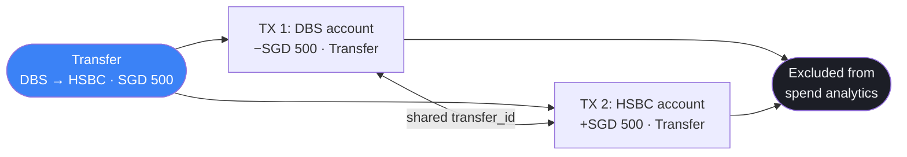

## How transfers work

When you transfer money between accounts (e.g. DBS → UOB, or pay your credit card bill), Vantage creates **two linked transactions** sharing the same `transfer_id` UUID:



Both transactions are excluded from spend analytics — they don't inflate your expense totals or distort category breakdowns.

---

## Pay Card

The **Pay Card** shortcut on the Accounts screen creates a Transfer automatically. Paying your credit card bill:
- Debits your bank account
- Credits your credit card (reducing the outstanding balance)
- Neither transaction appears in your spend analytics

<Note>
  **Loan payments are different.** Loan repayments do appear in spend analytics (under "Loan Payment" category). Only credit card payments are excluded via the Transfer mechanism.
</Note>

---

## Credit card balance reconciliation

On every app launch and resume, Vantage auto-reconciles all credit card balances:

```
balance = sum of all charges in the current billing cycle
```

The **current billing cycle** starts the day after your statement date. For example, if your statement closes on the 20th, your current cycle started on the 21st of last month.

This reconciliation runs silently and corrects any drift between the stored balance and the actual charges logged in the database.
