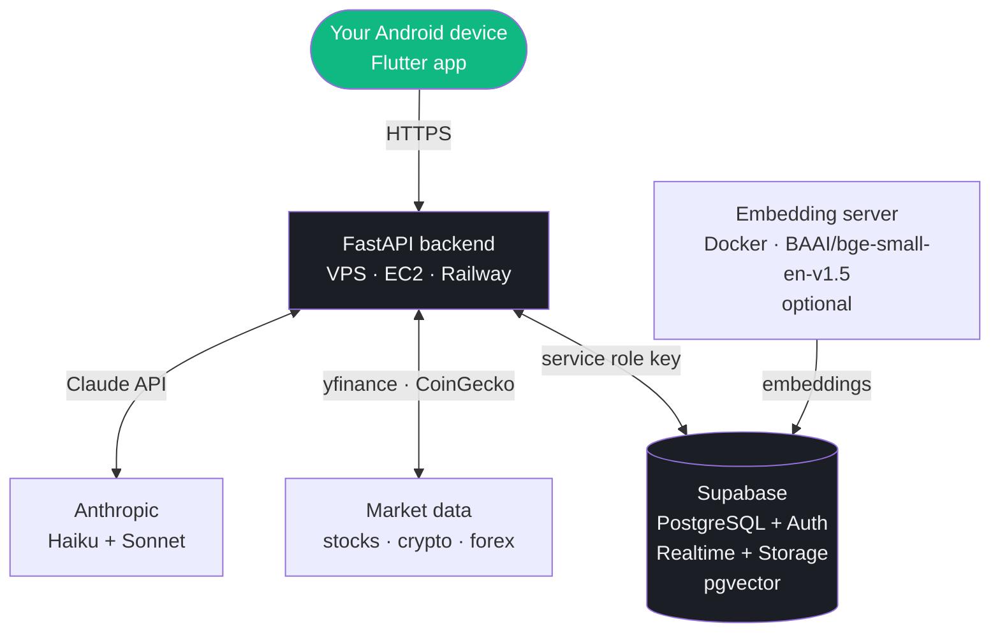

## Architecture

---

## Components

| Component | Where it runs | Required |
|-----------|--------------|----------|
| Flutter app | Your Android device | Yes |
| Supabase | Supabase cloud (or self-hosted) | Yes |
| FastAPI backend | VPS, EC2, Railway, Fly.io | Yes |
| Embedding server | Same server as FastAPI | Optional (for AI memory) |

---

## Minimum requirements

**FastAPI backend:**
- 1 vCPU, 512 MB RAM (t3.micro or equivalent)
- Python 3.11+
- Open port 8000 (or behind nginx on 443)

**Embedding server (optional):**
- 2 vCPU, 2 GB RAM recommended
- The BAAI model loads ~180 MB into memory
- Docker installed

---

## Data privacy

All your financial data lives in **your own Supabase project**. Vantage never sends transaction data to any third-party analytics service. The only external API calls are:
- Anthropic API (your question + relevant context, no raw transactions)
- Yahoo Finance / CoinGecko (ticker symbols only, no personal data)

<Card title="Deploy to AWS EC2" icon="aws" href="/self-hosting/ec2-deployment">
  Full guide for deploying the FastAPI backend to AWS EC2 with nginx and systemd.
</Card>
